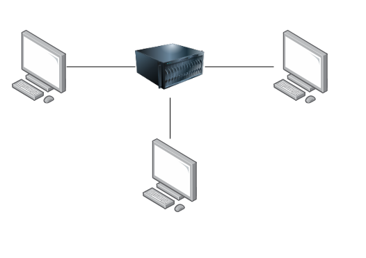

# WalkieTalkie
### Download our Client and Start using it
[](https://drive.google.com/uc?export=download&id=1NuFzJhJRuSryMWwsPBJspThRjE23lw4L)

WalkieTalkie is an instant message application. 

> This chat app runs on the terminal


____

## Index
1. [ Description ](#Description)
2. [ Technologies ](#Technologies)
3. [ Architecture ](#Architecture)
4. [ Using WalkieTalkie ](#Using-WalkieTalkie )
5. [Setting your own WalkieTalkie Server](#Setting-your-own-WalkieTalkie-Server)
---
## 
This is a Terminal chat implementation by using Typescript and web Socket technology. 

## Technologies
General
- Typescript

UI:
- Blessed
- Inquirer
- Socket io

Back
- Socket io
---

## Architecture
Web Sockets implementation follows the Client - Server architecture. There are clients connected to a Central server and it is in charge of distributing the information among them. Unlike the HTTP protocol, WebSocket keeps the connection open until the client decided just to disconnect. 

;

## [ Client ](./client/)
The chat is executed directly from the client terminal.

## [ Server ](./server/)
The server side implementation is served by an HTTP server and uses Nginx as reverse proxy.

----

## Using WalkieTalkie 

There is a server already running the WalkieTalkie implementation. To use the chat you only need to download the client and execute it. It will automatically connect with the existent server.


[Download WalkieTalkie Client](https://drive.google.com/uc?export=download&id=1NuFzJhJRuSryMWwsPBJspThRjE23lw4L)

> Important! you need to have Node 16 or above installed to run the client

Go to the folder were the client.js file was downloaded. Make sure it has the right permissions to be executed.


```
    chmod +x walkietalkie_client
```

Execute it
```
    ./walkietalkie_client
```

---


## Setting your own WalkieTalkie Server

Clone the repository
```
    git clone https://github.com/angellovc/WalkieTalkie.git
```

Go to WalkieTalkie
```
    cd WalkieTalkie
```
### Starting the Server

Go to server folder
```
    cd server
```
To start the server you have to set the PORT in which the server will be listening. To do that, set the env variable WALKIETALKIE_PORT to the port you want

```
    WALKIETALKIE_PORT=8080 node index.js
``` 
> It will set the WALKIETALKIE_PORT to 8080 before executing the server


### Starting the Client

In the root of the WalkieTalkie folder. Go to client folder

```
    cd client
```

Go to file [config.ts](./client//congif/congif.ts) and change HOST for the domain where your server is running along with the port you set before.

```
    enum settings {
        HOST = 'https://mydomainName.com:8080'
    }

```
