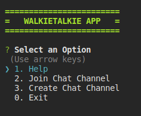
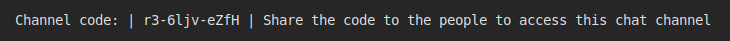
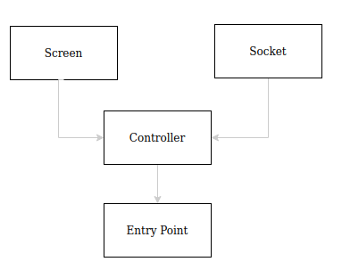

# WalkieTalkie Client

Download my implementation. It is connected to a server that does not store any user information and is encrypted by an SSL certificate in order to garantee the privacy.

## Overview
This is a Chat implementation that runs on the terminal. This chat uses channels to connect with others. The channel, in this case, is an analogy to the frequency in the walkietalkie radios. You are just able to see the messages of the people subscribed to the same channel.

As a user you have two options: create a new channel or join an existent one.

Once you select the create a channel option, the chat screen will be opened and in the upper part of it you'll be able see you channel. Every channel is unique and can be resausable no matter closed the chat before.

> You have to share this code with your friends in order to start chatting with them.

To reuse a channel use your previous channel use the option 2. (join to a channel) and put there the channel. If you and your friends forgot it, you can create a new one as many times you want.

## Architecture

This is a simple implementation where the chat logic is handled by some controller which are in charge of managing the connection between the UI and Red layer.

