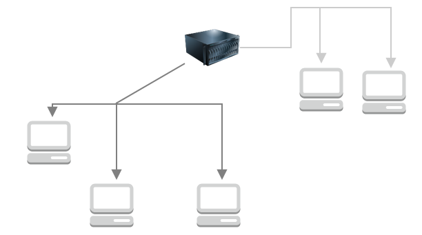

# WalkieTalkie Server

This is a WebSocket server in charge of distribute the WalkieTalkie chat messages across its different clients.

## Technologies

[](https://www.npmjs.com/package/typescript)

[](https://www.npmjs.com/package/socket.io)


## Overview
This implementaiton works in the same way the walkietalkie device works. This server is in charge of creating different channels and spread the messages across them.


> The image is showing two different channels with some computers connected to them

The messages are shared by the clients subscribed to the same Channel. In this case the server does not store any information to keep the privacy of the users.

## Setting your server up

To start the server you have to specify the PORT in which the server will be listening. To do that, set the env variable WALKIETALKIE_PORT to the port you want.

```
    WALKIETALKIE_PORT=8080 node index.js
``` 
> This command will intialize the server in the specified PORT.
> In this example, the server will be initialized in the port 8080


Every time a user is connected to the server, it generates a channel for it and a unique id. Nevertheless, the user is able to decide whether to use the generated channel or subscribe to others. [Check Client Implementation for more information](../client/).